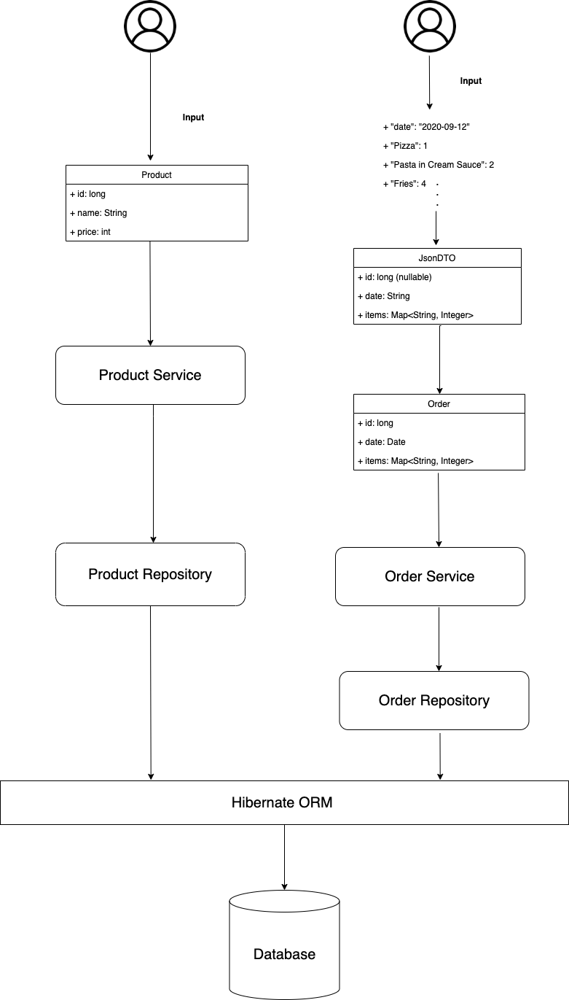

## Restful Restaurant Ordering System API


#### Intro:
This project provides fundamental functionality needed for restaurants managing their orders. There are 2 entities in the API, one is Order, whose attributes include order.id, order.date, order.subtotal and one map recording each item ordered as well as its required quantity. And the other is Product whose attirubtes include product.id, product.name, and product.price. Order entity serves as the main target users want to manage through this API. On the other hand, Product works as a reference like menu in restaurants, the only different is that users can modify this menu, adding or deleting current products through endpoints provided by this API. 


#### Tools:
- Spring MVC
- Spring Boot
- Spring Data & Hibernate
- JackSon
- Junit 
- Apache Maven


#### Provided REST API basic functions and endpoints

###### Order:

| HTTP Action   |  URL              |  Description 
| -----------   |  -----------      |  -----------
| ***GET***	    |  /order/all       |  Obtain all the orders details in database. <br/> - If call succeed, it will return list of orders as well as a Http status code 200, otherwise a 404.
| ***GET***           |  /order/{id}      |  Obtain specific order in database with {id} given by client. <br/> - If call succeed, it will return an order's detail and a Http status code 200, otherwise a 404. 
|***GET***      |  /order/          |  Filter orders by giving query parameter. Users can either assign one specific date and get all orders on that date or filter orders by a date range. <br/> - If call succeed, it will return list of orders as well as Http status 200, otherwise a 400.
| ***POST***          |  /order/          |  Create an order in database based on parameters provided by client. <br/>- If call succeed, it will return this created order along with a Http status code 201. <br/>- Otherwise, it will return a 400 or 404, depending on failure reason.
| ***PUT***           |  /order/          | Update an existing order by order parameter provided by users. <br/>- If call succeed, it will return the updated order back to users and Http status code 200. <br/>- Otherwise, depending on failure reason, it will return either a 400 or 404.
| ***DELETE***        |  /order/{id}      | Delete an existing order by {id} provided by users. <br/>- If call succeed, it will return deletion success messeage and Http status 200. <br/>- Otherwise, it will return Http status code 400.


###### Product:

| HTTP Action   |  URL              |  Description 
| -----------   |  -----------      |  -----------
| ***GET***	    |  /product/      |  Obtain all the products details in database. <br/> - If call succeed, it will return list of products as well as a Http status code 200, otherwise a 404.
| ***GET***           |  /product/{id}      |  Obtain specific product in database with {id} given by client. <br/> - If call succeed, it will return an product's detail and a Http status code 200, otherwise a 404. 
| ***GET***           |  /product/name      |  Obtain specific product in database with query parameter given by users <br/> - If call succeed, it will return the product and Http status code 200, otherwise 404.
| ***POST***          |  /product/          |  Create an product in database based on parameters provided by client. <br/>- If call succeed, it will return this created product along with a Http status code 201. <br/>- Otherwise, it will return a 400.
| ***PUT***           |  /product/          | Update an existing product by product detail provided by users. <br/>- If call succeed, it will return the updated product back to users and a Http status code 200. <br/>- Otherwise, it will return a 400. 
| ***DELETE***        |  /product/{id}      | Delete an existing product by {id} provided by users. <br/>- If call succeed, it will return deletion success messeage and Http status 200. <br/>- Otherwise, it will return a 400.


#### System Architecture




#### To Run it 

Before executing this API, users should set the [application.properties](../tree/master/src/main/resources/application.properties) file.
- Fill in database URL, user information to connect to database. 
Then type execute the following command in the directory containting the pom.xml file
```
$ mvn spring-boot:run
```
Then you can connect to http://localhost:{port number}/order or http://localhost:{port number}/product to play with it!


